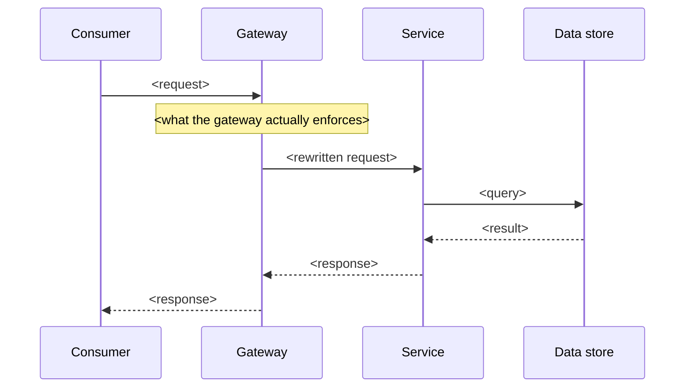

# As-is API reference — `<API or operation name>`

> Template for **Mode B**. Produces the reverse-engineered baseline that a refactoring
> recommendation rests on. Delete sections that do not apply; do not delete the provenance
> notes.
>
> This documents **current state**. Keep proposals out of it — they go in the ranked
> backlog. Mixing the two is how a review becomes contested on the facts rather than on the
> recommendation.

---

**Source:** `<repo / path / commit>`
**Status:** INDICATIVE — describes current state as built. `<Derived from code | derived
from the published spec | both>`.
**Purpose:** `<why this API is being documented now>`
**Scope:** `<operations covered, and adjacent ones deliberately excluded>`
**Primary consumers:** `<who calls this, as far as is known>`

_Last updated: YYYY-MM-DD_

---

## 1. Operations in scope

| Gateway / API | Operation | Method | Backend route | Backing service |
|---|---|---|---|---|
| | | | | |

Note anything that shares a backend with something else, or is exposed through more than
one front door.

---

## 2. Routing and trust boundary



**Authentication.** What is actually enforced, not what is configured. Note anything
declared but inert (commented-out policy, disabled middleware).

**Authorisation.** Is there a per-subject check? If not, say so plainly and state the
consequence.

---

## 3. Request contract

### 3.1 `<operation>`

| Parameter | In | Required | Declared schema | Actual use |
|---|---|---|---|---|

Call out declared-vs-actual mismatches: placeholder types, parameters read
case-insensitively, values compared by equality rather than validated as an enum.

---

## 4. Data flow

Tables/services touched, query shape, N+1 patterns, unbounded reads, pagination that is
deserialised but never followed. Include observed payload sizes if you have them —
concrete numbers carry the argument that adjectives do not.

---

## 5. Response contract: declared vs actual

### 5.1 What the document declares

Quote it. If it declares nothing beyond a status code, say exactly that.

### 5.2 What is actually returned

The real shape, reverse-engineered. Full schema in Appendix A.

### 5.3 Error responses

| Condition | Status | Body |
|---|---|---|

Flag conflations — most importantly "not found" and "crashed" returning the same thing.

---

## 6. Cohesion analysis

> Required when a decomposition is under discussion. See
> [09-decomposition](09-decomposition.md). Omit if not applicable, but do not omit it
> because it is inconvenient.

### 6.1 Consumer field inventory

| Field group | Consumer A | Consumer B | Unknown |
|---|---|---|---|

State the method used and its confidence. `unknown` is a legitimate value and is the work
remaining.

### 6.2 Cohesion by axis

| Field group | 1. Owning entity | 2. Change cadence | 3. Authz subject | 4. Populated per persona | Verdict |
|---|---|---|---|---|---|

Divergence on axis 3 is a **forced split**. Two or more of axes 1/2/4 is a candidate.

### 6.3 Nullability by persona

| Field group | Persona A | Persona B | Persona C |
|---|---|---|---|

A group empty for a whole persona is a different resource.

---

## 7. Gap summary

| Gap | Detail |
|---|---|

Mechanical gaps from `lint-api.sh` belong here, grouped by root cause rather than listed
one per finding.

---

## 8. Risks

Ordered by severity. For each: what it is, why it matters, what it is bounded by. Security
and privacy findings first — they are usually independent of whatever change prompted the
review, and they do not wait for it.

---

## 9. What this means for planning

| # | Finding | Consequence |
|---|---|---|

Consequences of the as-is state, not proposals. Proposals go in the backlog.

**Open questions to confirm**

- `<question>` — `<who can answer it>`

---

## Appendix A — Reverse-engineered response schema

```yaml
# OpenAPI fragment describing what is ACTUALLY returned.
# This is documentation of current behaviour, not a proposed contract.
```

State how it was derived and how far it was validated against real payloads.
